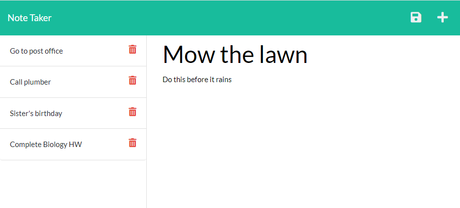

# Note Taking App

## Table of Contents

- [Description](#description)
- [Installation](#installation)
- [Usage](#usage)
- [License](#license)
- [Contribution](#contribution)
- [Contact](#contact)

## Description

This program is designed to serve as a user-friendly tool that can be used to save notes that are stored to a database where they can be reviewed at a later time, and deleted when no longer needed.

## Installation

This program requires Node.js and NPM. Once these are installed please run:
```
npm init -y

npm i express

npm i uuid
```
It also appears that using nodemon works better than node. Further work will be done to determine why this is the case. It is recommended that the user run:
```
nodemon server.js

```
instead of:
```
node server.js
```
To install nodemon globally, please issue the following command in terminal:
```
npm install --global nodemon
```

## Usage

For usage instructions, please do the following:

The first page

Generated HTML page



## Contribution

You may contact me directly, and then fork the project. Anyone can contribute, but please provide credit to the original work.

## Questions

Feel free to reach out to me directly if you have any questions or concerns. You can reach me via email, or check out my github profile below.

Email: huntersteffner@gmail.com

GitHub: [huntersteffner](https://github.com/huntersteffner/)

## Future developments

Add validation functionality to ensure that input is in the expected format.